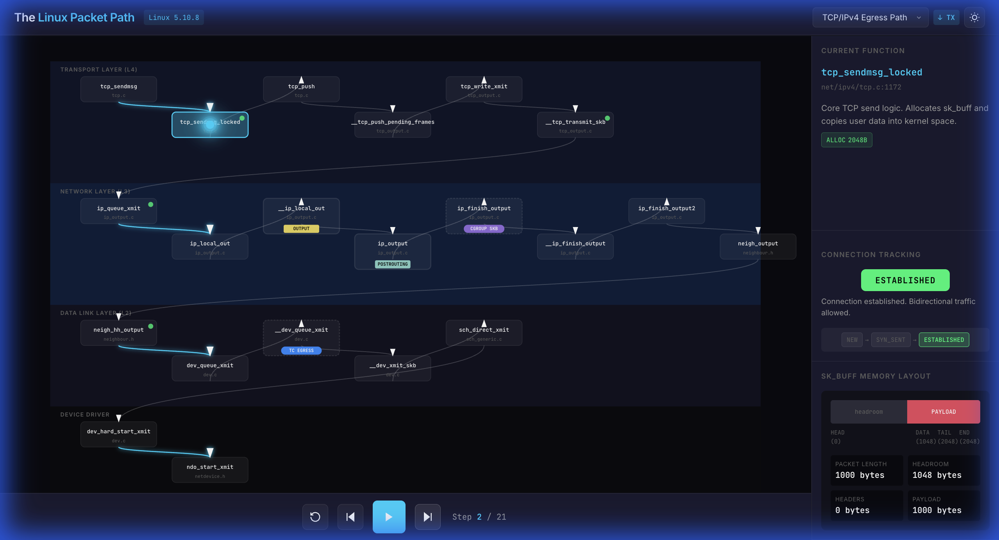
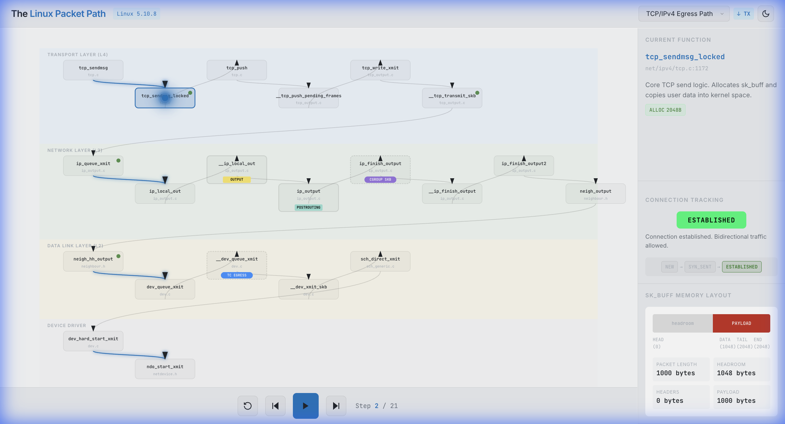

# Linux Packet Visualizer

An interactive Single Page Application for visualizing the Linux kernel packet path. Built for **SRE teaching** to help understand how packets flow through the networking stack.

> It's live at [linux-packet-visualizer.pages.dev](https://linux-packet-visualizer.pages.dev)


## Features

### Packet Path Visualization
- **TCP/IPv4 Egress Path** - 21 kernel functions from `tcp_sendmsg` to NIC driver
- **TCP/IPv4 Ingress Path** - 20 kernel functions from NAPI poll to socket delivery
- **Real-time sk_buff mutations** - Watch headers being pushed/pulled

### Hook Visualization
- **Netfilter Hooks** - PREROUTING, INPUT, OUTPUT, POSTROUTING
- **eBPF/XDP Hooks** - XDP, TC_INGRESS, TC_EGRESS, CGROUP_SKB

### User Interface
- **Dark/Light Mode** - Theme toggle with system preference detection
- **Connection Tracking** - TCP conntrack state visualization
- **Step-through Animation** - Play, pause, step forward/backward

## Quick Start

```bash
# Clone the repository
git clone https://github.com/rizkiamr/linux-packet-visualizer.git
cd linux-packet-visualizer

# Generate contract and start frontend
make dev

# Or run steps manually:
make generate  # Generate JSON contract
make frontend  # Start Vite dev server
```

Open http://localhost:5173 in your browser.

## Project Structure

```
linux-packet-visualizer/
├── cmd/contract/           # CLI for JSON contract generation
├── internal/contract/      # Go contract definitions
│   ├── skbuff.go          # sk_buff structure model
│   ├── layer.go           # Kernel layer enum
│   ├── function.go        # KernelFunction type
│   ├── graph.go           # Call graph & simulation
│   ├── netfilter.go       # Netfilter hook types
│   ├── bpf.go             # eBPF/XDP hook types
│   ├── conntrack.go       # Connection tracking states
│   ├── egress.go          # TCP/IPv4 egress path
│   ├── ingress.go         # TCP/IPv4 ingress path
│   └── export.go          # JSON export logic
├── frontend/               # React + Vite frontend
│   ├── src/
│   │   ├── components/    # React components
│   │   ├── hooks/         # Custom React hooks
│   │   └── styles/        # CSS styles
│   └── public/
│       └── data/          # Generated contract JSON
├── Makefile               # Build automation
└── go.mod                 # Go module definition
```

## Requirements

- **Go** 1.21+
- **Node.js** 18+
- **npm** 9+

## Make Targets

| Target | Description |
|--------|-------------|
| `make dev` | Generate contract + start dev server |
| `make generate` | Generate JSON contract only |
| `make frontend` | Start frontend dev server |
| `make build` | Build production frontend |
| `make install` | Install all dependencies |
| `make clean` | Clean generated files |

## Architecture

### Go Contract

The Go code defines the kernel packet path as a typed contract:

```go
type KernelFunction struct {
    ID            string         `json:"id"`
    Name          string         `json:"name"`
    Layer         Layer          `json:"layer"`
    SourceFile    string         `json:"sourceFile"`
    SKBMutation   *SKBMutation   `json:"skbMutation,omitempty"`
    NetfilterHook *NetfilterHook `json:"netfilterHook,omitempty"`
    BPFHook       *BPFHook       `json:"bpfHook,omitempty"`
}
```

### Frontend

The React frontend renders the contract as an interactive SVG visualization:

- **SVGCanvas** - Main visualization with layer backgrounds and function nodes
- **FunctionNode** - Individual kernel function with hook badges
- **SKBuffDiagram** - Memory layout showing header push/pull
- **ConntrackInfo** - TCP connection state display

## Kernel Version

Based on **Linux 5.10.8** source code. Function line numbers and paths reference this version.

## Screenshots

### Dark Mode


### Light Mode


## Contributing

Contributions welcome! Some ideas:

- Add UDP/ICMP paths
- Add error paths (packet drops)
- Add more BPF hook types
- Add zoom/pan to canvas
- Link to kernel source code

## License

MIT License

## References

- [Linux Network Stack](https://www.kernel.org/doc/html/latest/networking/)
- [Netfilter Hooks](https://netfilter.org/documentation/)
- [XDP Documentation](https://prototype-kernel.readthedocs.io/en/latest/networking/XDP/)
- [Connection Tracking](https://conntrack-tools.netfilter.org/)
